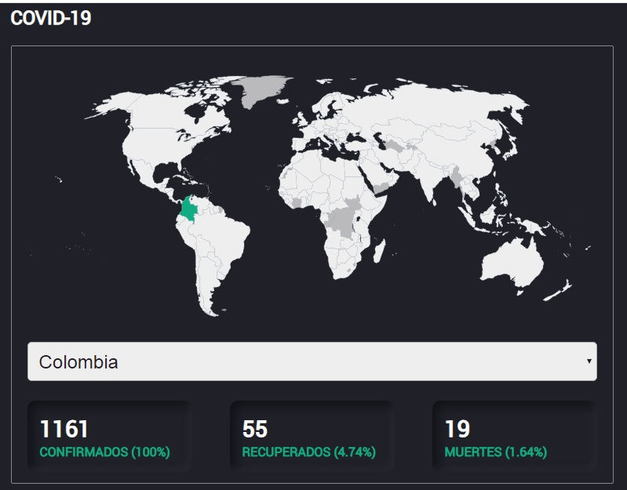

# covid-19

¿How does that work?

Require Node.js 8.x

* `yarn install` to install the dependencies
* `yarn dev` to run development mode app
* `yarn start` to build production

# Made with
* React
* React Hooks
* JavaScript
* Next.js
* Zeit/now
* Moment

# Data source
[Covid-19 API](https://github.com/mathdroid/covid-19-api)

# License

MIT License 2020.

Transitively from the John Hopkins Site, the data may not be used for commercial purposes.
